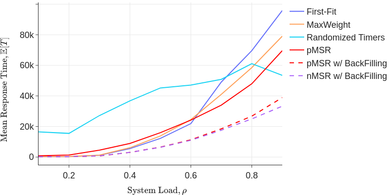

# Introduction

This code produces Figure 4 in the paper "Improving Multiresource Job Scheduling with Markovian
Service Rate Policies".

If you do not wish to run the code yourself, the outputs of the simulation are saved under `borg/*.npy`. With the .npy files, you can simply run `python3 borg/plot-all.py`, which generates Figure 4 --- `borg.png` under the project directory.

# Prerequisites
## Gurobi C++ and Python Library Installation
[This tutorial](https://ca.cs.uni-bonn.de/doku.php?id=tutorial:gurobi-install) provides a detailed guide to install Gurobi environment.

Be sure to set environment `GUROBI_HOME` before compiling the code.

# Usage
## How do I construct an MSR policy?

The `get_candidates(C, D, lmb)` function in `maxmin.py` takes 3 parameters:
* C: the capacity vector 1xR
* D: the demand vector KxR
* lmb: the arrival rate vector 1xK

where K is the number of job types and R is the number of resources.

If the optimization problem is feasible, it will return the `alpha, candidates`, where alpha is the fraction of time we are spending in each candidate and candidates being the candidate set defined in the paper.

## WIP